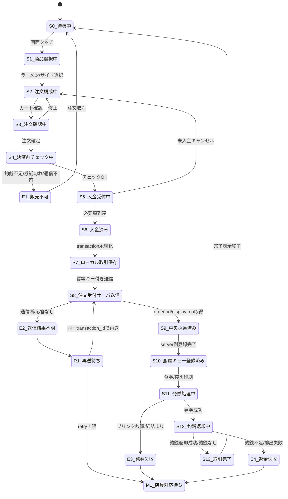
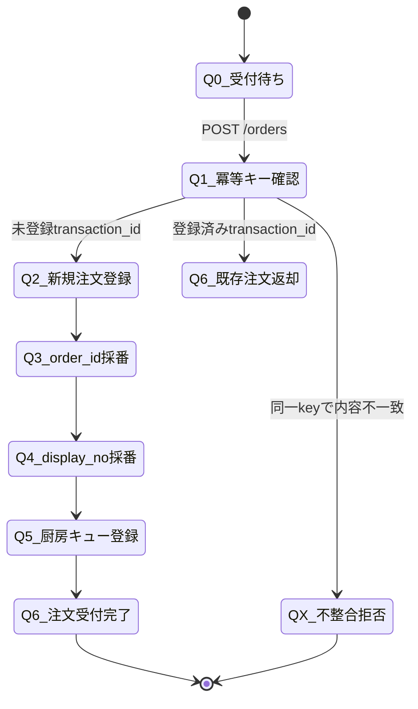
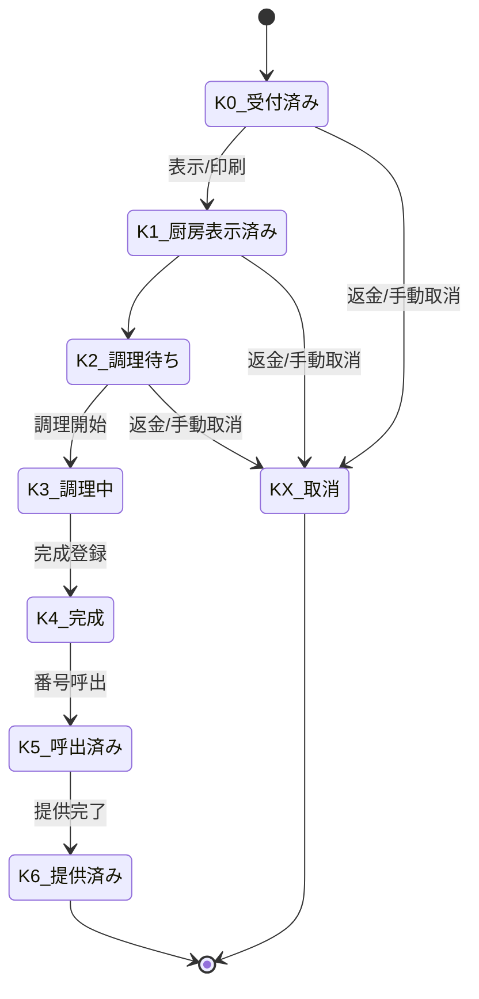
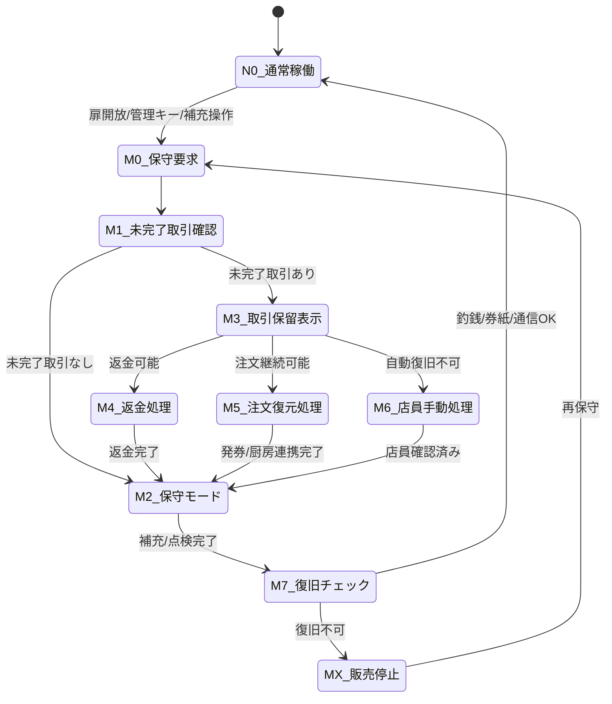
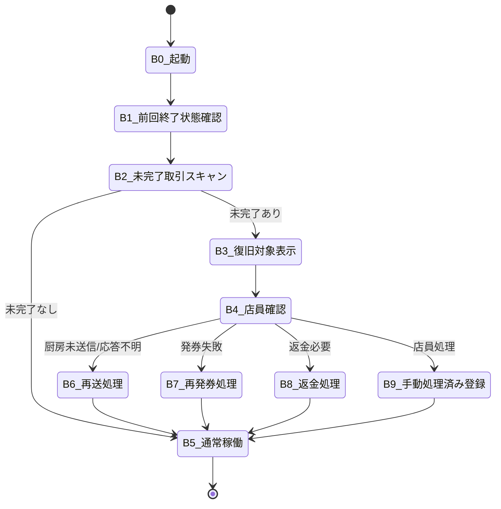
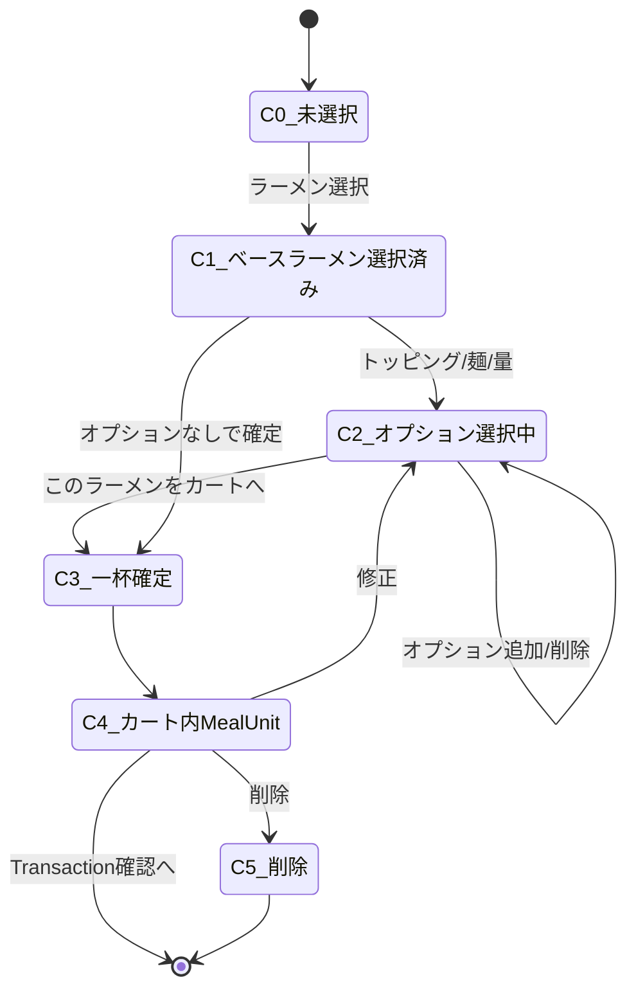

# 状態遷移書
## ラーメン店券売機・厨房連携システム

## 1. 券売機取引状態遷移



---

## 2. 注文受付サーバ状態遷移



---

## 3. 厨房キュー状態遷移



---

## 4. 保守モード状態遷移



---

## 5. 起動時復旧状態遷移



---

## 6. MealUnit構成状態遷移



---

## 7. 状態設計上の要点

```text
- 画面状態と取引状態を分離する
- 決済済み状態は永続化する
- 厨房送信待ち・再送待ちは未来実行義務として扱う
- 保守モード移行前に未完了取引を必ず確認する
- 起動時に未完了取引を必ずスキャンする
- トッピングは必ずMealUnitに紐付ける
- 中央採番点でdisplay_noを直列化する
- transaction_idを冪等キーとして二重注文を防止する
